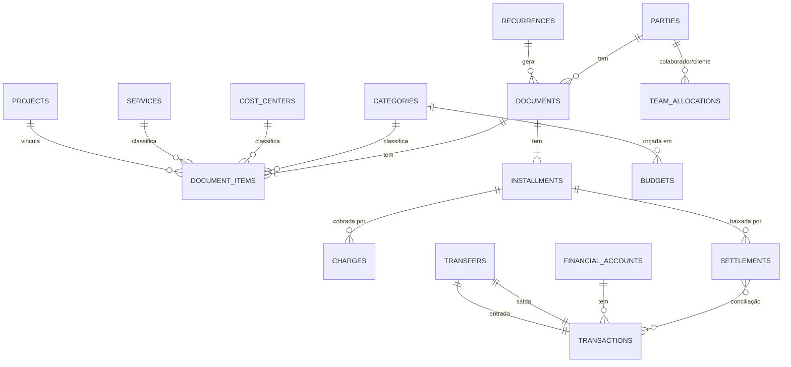

# Viofilme ERP — Módulo Financeiro
## Regras gerais, modelo de dados e princípios

**Versão:** 1.0 · setembro/2026
**Público:** desenvolvimento (Gui) e produto
**Status:** decisões globais travadas. As páginas (Dashboard, Recebimentos, Pagamentos, Caixa, Resultados, Planejamento e Configurações) serão especificadas em documentos próprios, **todos subordinados a este**.

> Este documento define o que vale para o módulo inteiro. Se uma spec de página contradisser algo aqui, este documento prevalece até ser revisado explicitamente.

---

## Sumário

1. Objetivo e escopo
2. Princípios de produto
3. Independência do módulo
4. Arquitetura de páginas
5. Modelo de dados — entidades
6. Relacionamentos
7. Status e transições
8. Datas: competência, vencimento e pagamento
9. Recorrências
10. Categorias e tipo de impacto
11. Estrutura da DRE gerencial
12. Dimensões de análise e obrigatoriedade de campos
13. Movimentações, extrato e conciliação
14. Gateway de pagamento (Asaas)
15. Rateio de equipe e rentabilidade
16. Dicionário de métricas
17. Cancelamento, estorno, exclusão e fechamento de período
18. Aprovação
19. Auditoria e origem dos registros
20. Integrações (padrão de eventos)
21. Visibilidade e permissões
22. Ficha universal
23. Regras invariantes (testáveis)
24. Convenções técnicas
25. Fora de escopo
26. Anotações para a revisão de outros módulos
27. Evoluções futuras

---

## 1. Objetivo e escopo

O módulo Financeiro é um **financeiro gerencial de agência**. Ele responde a três perguntas, em camadas:

1. **O que eu preciso fazer?** É a camada operacional, trabalhada por exceção: cobrar, pagar, conciliar, aprovar.
2. **Como está o dinheiro?** Caixa realizado e previsto, recebíveis e obrigações.
3. **A empresa está dando resultado, e onde?** DRE gerencial, margem, rentabilidade por cliente e serviço, planejado vs. realizado.

**Não é:** contabilidade oficial, escrituração fiscal, emissor de nota fiscal, sistema bancário, folha de pagamento, FP&A corporativo nem BI.

O mesmo sistema precisa atender dois perfis de uso: o **gestor multitarefa**, que usa pouco tempo por dia e precisa ver só o que exige ação, e um **responsável financeiro dedicado**, que opera o dia inteiro.

---

## 2. Princípios de produto

| Princípio | Regra prática |
|---|---|
| **Complexidade no modelo, não na tela** | Regras, vínculos e derivações ficam no banco e nas automações. A interface mostra o mínimo necessário. |
| **Trabalho por exceção** | O sistema aponta o que venceu, atrasou, não foi conciliado ou está fora do orçamento. O usuário não precisa procurar problemas. |
| **Progressive disclosure** | Primeiro vem a lista e o número. O detalhe aparece no drawer, na ficha ou no expand. |
| **Uma informação nasce uma vez** | Nenhum dado é recadastrado. Registros derivados apontam para a origem. |
| **Automação com controle humano** | Tudo que é automático mostra de onde veio, o que foi gerado e o impacto de uma alteração. |
| **Tab só com mudança real de atividade** | Tabs nunca servem para organização visual. |
| **Cada página abre na lista de trabalho** | Cada página abre direto na lista de trabalho, com uma faixa de 3 a 4 KPIs no topo. Só o Dashboard é um panorama, e as demais páginas não têm tab "Visão geral". |
| **Poucas páginas excelentes** | Toda funcionalidade nova precisa justificar problema, frequência e por que não cabe em algo que já existe. |

---

## 3. Independência do módulo

O Financeiro **funciona sozinho**. Sem nenhum outro módulo do ERP, deve ser possível:

- cadastrar pessoas (clientes, fornecedores, colaboradores);
- cadastrar contas financeiras, categorias, serviços e projetos;
- criar títulos a receber e a pagar, recorrências, cobranças e baixas;
- importar extrato e conciliar;
- ver DRE, rentabilidade, fluxo de caixa e orçamento.

As integrações com outros módulos **apenas pré-preenchem ou disparam** registros que o Financeiro também sabe criar manualmente. Nenhuma tela, regra ou cálculo pode depender da existência de outro módulo.

Todo registro tem três origens possíveis:

| Origem | Exemplo |
|---|---|
| `manual` | Usuário criou no Financeiro |
| `internal` | Nasceu de evento de outro módulo (Comercial, Operação, RH) |
| `external` | Veio de integração ou importação (Asaas, banco, OFX/CSV) |

---

## 4. Arquitetura de páginas

```
💰 Financeiro
├── Dashboard               → "Tem algum problema que eu preciso resolver hoje?"
├── Recebimentos            → tudo que precisa entrar
├── Pagamentos              → tudo que sai
├── Caixa                   → movimentação do dinheiro (fluxo, extrato, conciliação, contas)
├── Resultados              → onde ganhamos ou perdemos dinheiro (DRE, rentabilidade, receita)
├── Planejamento            → orçamento, forecast, cenários
└── Configurações Financeiras → cadastros de suporte e regras
```

As páginas são **lentes diferentes sobre o mesmo núcleo de dados**. Exemplo de uma mesma cobrança:

| Página | Como a cobrança aparece |
|---|---|
| Recebimentos | Parcela a receber |
| Caixa | Entrada prevista, e depois movimentação realizada |
| Resultados | Receita, pela competência |
| Planejamento | Realizado vs. orçado |
| Dashboard | Parte de um indicador agregado |

**Fonte de cada página (regra fixa):**

| Página | Lê de |
|---|---|
| Recebimentos / Pagamentos | Parcelas (`installments`) |
| Caixa | Movimentações (`transactions`) + parcelas em aberto (previsto) |
| Resultados | Itens de título (`document_items`) por competência + alocações |
| Planejamento | Orçamentos (`budgets`) vs. itens + projeção de recorrências |
| Dashboard | Camada de métricas (seção 16) |

---

## 5. Modelo de dados — entidades

Os nomes técnicos são sugestões e podem ser ajustados, mas o conceito de cada entidade não pode ser misturado com o de outra.

### 5.1 Cadastros

**Pessoa** · `parties`
Qualquer pessoa física ou jurídica. **Cadastro único do ERP**, compartilhado com CRM, Hub e RH. Uma mesma pessoa pode ter vários papéis.
- Campos-chave: `id`, `type` (PF/PJ), `name`, `legal_name`, `document` (CPF/CNPJ, único quando preenchido), `email`, `phone`, `roles[]` (`client`, `supplier`, `employee`, `partner`), `status`.
- Regra: o CPF/CNPJ é usado para deduplicar e para casar pagamentos PIX na conciliação.

**Conta financeira** · `financial_accounts`
Onde o dinheiro está.
- Tipos: `bank`, `gateway` (Asaas), `cash` (caixa físico), `credit_card`, `investment`.
- Campos-chave: `name`, `type`, `institution`, `initial_balance`, `initial_balance_date`, `counts_as_available` (compõe o saldo disponível), `requires_statement_confirmation` (confirma por extrato), `status`.
- Regra: **o saldo nunca é digitado.** Saldo = saldo inicial + movimentações.

**Categoria** · `categories`
Plano de contas gerencial, com **no máximo 2 níveis** (grupo › categoria).
- Campos-chave: `name`, `parent_id`, `direction` (entrada/saída), `impact_type` (seção 10), `default_cost_center_id`, `requires_client` (bool), `requires_employee` (bool), `status`.

**Centro de custo** · `cost_centers`
Área da empresa. Lista curta e fixa: **Entrega, Comercial, Administrativo, Diretoria**. Squads são subdivisões de Entrega, criadas quando houver mais de um.

**Serviço** · `services`
Linha de receita, por exemplo Social Media, Tráfego, Audiovisual, Projetos. Base da rentabilidade por serviço.

**Projeto** · `projects`
Entrega pontual com início e fim. Pode nascer na Operação ou no Financeiro. Vincula receitas e custos para calcular a rentabilidade do projeto.

**Contrato** · `contracts` *(referência)*
Pertence ao Comercial/CS. O Financeiro **pode apontar** para um contrato, mas não depende dele: uma recorrência existe sem contrato.

### 5.2 Núcleo transacional

**Recorrência** · `recurrences`
**Regra** que gera títulos periodicamente. Não é um título.
- Campos-chave: `direction`, `party_id`, `items` (modelo dos itens), `frequency` (mensal por padrão), `due_day`, `start_date`, `end_date` (opcional), `adjustment_rule` (reajuste, opcional), `status` (`active`, `paused`, `ended`), `contract_id` (opcional), `generation_horizon`.

**Título** · `documents`
O **compromisso financeiro**: "a APTO me deve a mensalidade de setembro" ou "eu devo o aluguel de outubro". A receber e a pagar são **o mesmo objeto** com direção diferente.
- Campos-chave: `direction` (`in`/`out`), `party_id`, `description`, `issue_date`, `total_amount`, `recurrence_id` (opcional), `project_id` (opcional), `origin`, `origin_ref`, `notes`, `attachments`.
- O status do título é **derivado** das parcelas.

**Item do título** · `document_items`
Linha do título. **É aqui que moram as dimensões de análise.** O rateio de uma despesa entre categorias ou clientes é feito com vários itens, sem nenhuma funcionalidade separada.
- Campos-chave: `document_id`, `amount`, `category_id`, `cost_center_id`, `service_id`, `client_id`, `project_id`, `employee_id`, `description`.
- Regra: a soma dos itens = valor total do título.

**Parcela** · `installments`
Unidade que vence. **É a unidade operacional** de Recebimentos e Pagamentos.
- Campos-chave: `document_id`, `number` (1/3, 2/3…), `due_date`, `competence_month`, `amount`, `open_balance`, `status`, `approval_status` (quando aplicável), `scheduled_payment_date` (opcional).
- Os itens do título são distribuídos proporcionalmente entre as parcelas para fins de competência.

**Cobrança** · `charges`
**Instrumento** enviado ao cliente (boleto, PIX, link de pagamento) para uma parcela de entrada.
- Campos-chave: `installment_id`, `method`, `provider` (Asaas, manual), `external_id`, `url`, `status` no provedor, `sent_at`.
- Regra: 1 parcela → 0..N cobranças (reemissões). **A parcela é a verdade financeira; a cobrança é só o instrumento.**

**Baixa** · `settlements`
Registro de que uma parcela foi paga, total ou parcialmente.
- Campos-chave: `installment_id`, `date`, `principal_amount`, `interest_amount` (juros), `fine_amount` (multa), `discount_amount`, `financial_account_id`, `method`, `origin`.
- Regra: só o **principal** abate o saldo da parcela. Juros e multa viram resultado financeiro, e o desconto vira dedução ou despesa financeira conforme a categoria configurada.

**Movimentação** · `transactions`
Dinheiro que **efetivamente passou** numa conta financeira.
- Campos-chave: `financial_account_id`, `date`, `amount` (positivo = entrada, negativo = saída), `description_raw`, `counterparty_document`, `origin` (`manual`, `import`, `integration`), `external_id`, `fingerprint`, `confirmation_status` (`pending_confirmation`, `confirmed`), `reconciliation_status` (`unreconciled`, `reconciled`).

**Conciliação** · `reconciliation_links`
Vínculo **N:N** entre movimentação e baixa. Um PIX pode quitar duas parcelas, e uma parcela pode ser paga em dois PIX.
- Campos-chave: `transaction_id`, `settlement_id`, `amount`, `created_by`, `method` (`auto`, `suggested`, `manual`).

**Transferência** · `transfers`
Par de movimentações entre contas próprias. Sem título e sem impacto em resultado.
- Campos-chave: `from_transaction_id`, `to_transaction_id`, `amount`, `date`.

### 5.3 Gestão

**Alocação de equipe** · `team_allocations`
Base do rateio de pessoal (seção 15).
- Campos-chave: `month`, `employee_id`, `client_id`, `weight` (padrão 1), mais `employee_capacity` (capacidade do colaborador no mês, em nº de clientes).

**Orçamento** · `budgets`
Valor planejado por categoria × mês (× cenário).
- Campos-chave: `month`, `category_id`, `cost_center_id` (opcional), `scenario` (`base` por padrão), `amount`.

**Período** · `periods`
Mês contábil gerencial.
- Campos-chave: `month`, `status` (`open`, `closed`), `closed_at`, `closed_by`.

**Auditoria** · `audit_events`
Log de todas as alterações (seção 19).

**Regra de categorização aprendida** · `categorization_rules`
Associação aprendida na conciliação, por exemplo "descrição contém ADOBE → fornecedor Adobe, categoria Software".

---

## 6. Relacionamentos



**Leitura rápida:**

```
Recorrência ──gera──▶ Título ──tem──▶ Itens (categoria, serviço, cliente, centro de custo…)
                         └──tem──▶ Parcelas ──▶ Cobrança (instrumento)
                                       └──▶ Baixas ◀──conciliação──▶ Movimentações ◀── Conta financeira
```

---

## 7. Status e transições

### 7.1 Parcela — status armazenado

| Status | Significado |
|---|---|
| `open` (Aberta) | Sem baixa |
| `partial` (Parcial) | Com baixa, saldo > 0 |
| `settled` (Liquidada) | Saldo = 0 |
| `cancelled` (Cancelada) | Encerrada sem pagamento, com motivo |
| `renegotiated` (Renegociada) | Encerrada e substituída por novo título |

| Transição | Gatilho / regra |
|---|---|
| Aberta → Parcial | Baixa com principal < saldo |
| Aberta/Parcial → Liquidada | Saldo chega a zero |
| Liquidada/Parcial → Aberta/Parcial | **Somente por estorno de baixa**, com motivo |
| Aberta → Cancelada | Com motivo obrigatório. Só é possível sem baixas |
| Parcial → Cancelada | Cancela apenas o **saldo restante**. A parte paga permanece |
| Aberta/Parcial → Renegociada | Acordo gera novo título. A parcela original aponta para ele (`renegotiated_to`) |

### 7.2 Status derivados (calculados, nunca gravados)

- **Vencida:** `due_date < hoje` e saldo > 0
- **Vence hoje / Vence em 7 dias**
- **Dias de atraso:** `hoje − due_date`
- **Faixa de aging:** 1–7, 8–15, 16–30, 31–60, 60+ dias

**Por quê:** status gravado que depende do tempo ("vencido") fica desatualizado e exige job para corrigir. Derivado está sempre certo.

### 7.3 Eixos paralelos (não se misturam ao status)

- **Aprovação:** `not_required` · `pending` · `approved` · `rejected`. Existe só quando a regra de aprovação está ligada (seção 18).
- **Conciliação:** calculada a partir das baixas. Uma parcela liquidada tem baixas conciliadas ou não conciliadas.

### 7.4 Status do título (derivado das parcelas)

- Todas liquidadas → **Liquidado**
- Alguma com baixa, mas não todas → **Parcialmente pago**
- Nenhuma baixa → **Em aberto**
- Todas canceladas → **Cancelado**

"Programado" **não é status**. É uma parcela aberta com `scheduled_payment_date` preenchida.

---

## 8. Datas: competência, vencimento e pagamento

Toda parcela tem **duas datas independentes**:

| Data | Uso |
|---|---|
| `competence_month` | DRE, rentabilidade, receita, orçamento (regime de competência) |
| `due_date` | Recebimentos, Pagamentos, fluxo de caixa **previsto**, aging |
| `settlements.date` | Fluxo de caixa **realizado** |

**Regras:**
- A competência é pré-preenchida com o mês do vencimento e pode ser editada. Exemplo: serviço de agosto com vencimento em 05/09 tem competência agosto.
- Em recorrências, a competência é o mês de referência do serviço, configurável na recorrência (mês corrente ou mês anterior ao vencimento).
- Em projetos parcelados, cada parcela tem a sua competência. O padrão é o mês do vencimento, editável quando a entrega ocorre em outro mês.
- Alterar a competência de uma parcela em **período fechado** exige justificativa (seção 17).

---

## 9. Recorrências

**Recorrência é regra, não título.**

**Materialização:**
- A recorrência **materializa** títulos numa janela curta à frente. Padrão: **3 meses**, configurável.
- Um job diário garante que a janela esteja sempre preenchida.
- O **forecast de longo prazo projeta virtualmente** a partir das regras ativas, sem criar registros.

**Por quê:** criar 12 ou 24 meses de títulos gera centenas de registros que precisam ser corrigidos a cada reajuste. A janela curta dá visibilidade operacional; a projeção virtual dá visão gerencial.

**Edição de uma recorrência:**
- Ao editar valor, dia, itens ou categoria, o sistema pergunta: **"Aplicar só a este título" / "A este e aos próximos"**.
- "A este e aos próximos" atualiza a regra e todos os títulos materializados **em aberto e sem baixa** a partir do escolhido.
- **Títulos com baixa (total ou parcial) nunca são alterados por edição de recorrência.**
- A alteração fica registrada na auditoria da recorrência com a data de vigência.

**Pausa:** a recorrência para de gerar. Títulos já materializados em aberto aparecem para o usuário decidir entre manter ou cancelar. Recorrências pausadas **saem do MRR**.

**Encerramento:** define `end_date`. Títulos materializados após essa data e ainda sem baixa são cancelados automaticamente, com motivo "Recorrência encerrada".

**Reajuste:** a regra é opcional (percentual fixo ou índice informado manualmente) com data. O sistema **avisa** 30 dias antes e aplica na data, a partir do primeiro título ainda não emitido.

**Clientes com vários serviços:** uma recorrência pode ter vários itens, um por serviço, e gera **um título com vários itens → uma parcela → uma cobrança**. O cliente recebe um único boleto e a receita continua separada por serviço.

---

## 10. Categorias e tipo de impacto

Toda categoria tem exatamente um **tipo de impacto**, que determina automaticamente onde ela aparece:

| `impact_type` | Exemplos | DRE | Caixa |
|---|---|---|---|
| `operating_revenue` — Receita operacional | Fee mensal, projeto, diária | ✅ Receita bruta | ✅ |
| `revenue_deduction` — Dedução da receita | DAS/ISS sobre faturamento, desconto concedido | ✅ Deduções | ✅ |
| `direct_cost` — Custo direto | Equipe de entrega, freelancer de cliente, locação para job | ✅ Custos diretos | ✅ |
| `operating_expense` — Despesa operacional | Aluguel, softwares gerais, administrativo, comercial, pró-labore | ✅ Despesas operacionais | ✅ |
| `financial_result` — Resultado financeiro | Tarifa bancária, taxa do gateway, juros/multa, rendimento | ✅ Resultado financeiro | ✅ |
| `investment` — Investimento | Câmera, lente, computador, reforma | ❌ (abaixo da DRE, informativo) | ✅ |
| `equity_financing` — Sócios e financiamento | Aporte, distribuição de lucros, empréstimo (principal) | ❌ (abaixo da DRE, informativo) | ✅ |

**Regras e motivos:**

- **A transferência entre contas não é categoria.** É uma operação (`transfers`). Assim ela nunca pode ser lançada, por engano, como despesa.
- **Pró-labore é despesa operacional; distribuição de lucros é `equity_financing`.** O pró-labore remunera trabalho, enquanto a distribuição é retorno ao sócio. Se tudo fosse despesa, o resultado variaria conforme a forma de retirada dos sócios.
- **Equipamento é investimento.** Uma compra grande não pode destruir a margem de um único mês. Depreciação gerencial fica como evolução futura.
- **Taxa do gateway é resultado financeiro**, porque é custo de cobrar e não imposto sobre a venda.
- **Juros de empréstimo** vão para `financial_result`. O **principal** vai para `equity_financing`.
- A lista de tipos de impacto é **fechada no sistema**. Categorias são livres; tipos de impacto não.

---

## 11. Estrutura da DRE gerencial

Regime de **competência**, montada automaticamente a partir do `impact_type` das categorias.

```
Receita bruta                          (operating_revenue)
(−) Deduções da receita                (revenue_deduction)
= Receita líquida
(−) Custos diretos                     (direct_cost: equipe de entrega + ociosidade + custos de clientes/projetos)
= Margem bruta
(−) Despesas operacionais              (operating_expense)
= Resultado operacional
(±) Resultado financeiro               (financial_result)
= Resultado líquido
────────────────────────────────────────
Informativo (fora da DRE):
    Investimentos do período           (investment)
    Movimentações com sócios e financiamento (equity_financing)
```

**Regras:**
- Pessoal de **Entrega** (centro de custo Entrega) entra em **Custos diretos**. Pessoal de Comercial, Administrativo e Diretoria entra em **Despesas operacionais**.
- Visões: Mês · Trimestre · Ano, com comparação ao período anterior.
- O bloco informativo existe para responder, na mesma tela, "gerei lucro, mas cadê o dinheiro?".

---

## 12. Dimensões de análise e obrigatoriedade de campos

A obrigatoriedade é **condicional à categoria**: cada campo obrigatório existe porque alimenta uma análise definida.

| Campo | Regra | Alimenta |
|---|---|---|
| Categoria | **Sempre obrigatória** | DRE, orçamento |
| Pessoa (cliente/fornecedor) | **Sempre obrigatória**, exceto em lançamentos bancários (tarifa, rendimento) | Aging, histórico por fornecedor/cliente |
| Descrição | **Sempre obrigatória**, com padrão sugerido (ex.: "Mensalidade Set/26 — APTO") | Leitura sem contexto |
| Centro de custo | **Sempre obrigatório**, sugerido pela categoria (`default_cost_center_id`) | DRE por área, custo comercial |
| Cliente e/ou projeto | Obrigatório quando `impact_type` = `operating_revenue` ou `direct_cost` | Rentabilidade |
| Serviço | Obrigatório quando `impact_type` = `operating_revenue` | Margem por serviço |
| Colaborador | Obrigatório quando a categoria é de pessoal (`requires_employee`) | Rateio de equipe |
| Observação, anexos | Opcionais, sempre visíveis na ficha | Contexto |

**Custo direto sem cliente específico** (ex.: software usado por toda a entrega) usa o cliente especial **"Operação geral"**. Na rentabilidade, esse valor aparece como custo de entrega não atribuído e não é distribuído entre clientes.

**Inferência automática (reduz digitação):**
- A recorrência preenche todos os campos dos títulos que gera.
- O fornecedor sugere a última categoria e o último centro de custo usados com ele.
- A categoria sugere o centro de custo.
- As regras aprendidas na conciliação sugerem pessoa e categoria.

---

## 13. Movimentações, extrato e conciliação

### 13.1 Origens de movimentação

Todas as origens geram registros em `transactions`, com o mesmo tratamento:

| Origem | Como nasce |
|---|---|
| `manual` | Ao dar baixa numa parcela, ou por lançamento direto em Caixa |
| `import` | Arquivo **OFX ou CSV** do banco (o CSV precisa de mapeamento de colunas salvo por conta) |
| `integration` | API bancária ou webhook do gateway, via Edge Function |

A arquitetura deve estar **pronta para importação e integração desde o início**, mesmo que a integração bancária entre depois.

### 13.2 Deduplicação

- Movimentações importadas ou integradas guardam `external_id` (quando o banco fornece) e `fingerprint` = hash(conta + data + valor + descrição normalizada).
- Reimportar o mesmo arquivo **nunca duplica**. Linhas já existentes são ignoradas e contadas no resumo da importação.

### 13.3 Baixa manual × extrato (regra anti-duplicidade)

Cada conta financeira tem `requires_statement_confirmation`:

- **`true`** (bancos, Asaas): a baixa manual gera uma movimentação `pending_confirmation`. Quando o extrato traz uma linha compatível (mesma conta, mesmo valor, data ±3 dias), as duas são **fundidas**: a movimentação passa a `confirmed` e herda o `external_id`, sem criar um registro novo.
- **`false`** (caixa físico): a baixa manual gera movimentação já `confirmed`.

Movimentações `pending_confirmation` há mais de 7 dias viram **exceção** ("baixa sem confirmação no extrato").

### 13.4 Motor de sugestão da conciliação

Em ordem de confiança:

| Nível | Critério | Ação |
|---|---|---|
| 1 | `external_id` do gateway corresponde a uma cobrança | Concilia **automaticamente** |
| 2 | Valor exato + data ±3 dias + CPF/CNPJ do pagador | Sugestão forte (1 clique) |
| 3 | Valor exato + data ±3 dias | Sugestão fraca (1 clique, com alternativas) |
| 4 | Regra aprendida por texto (`categorization_rules`) | Sugere pessoa + categoria para criar título |

- **Aprendizado:** confirmar duas vezes a mesma associação de texto → pessoa/categoria cria uma regra, que pode ser editada ou desativada em Configurações.
- **Movimentação sem título** (tarifa, rendimento, despesa não lançada): ao conciliar escolhendo uma categoria, o sistema cria nos bastidores **título + parcela + baixa já liquidados**. **Por quê:** a DRE lê sempre de itens de título, nunca de movimentações soltas.
- **Diferença de valor** (ex.: recebeu R$ 4.590 numa parcela de R$ 4.500): a diferença é classificada como juros/multa (se maior) ou como desconto/baixa parcial (se menor), por escolha do usuário na hora de conciliar.

---

## 14. Gateway de pagamento (Asaas)

O Asaas é uma **conta financeira** do tipo `gateway`.

**Fluxo:**
1. Uma parcela a receber gera uma **cobrança** no Asaas (via Edge Function), guardando `external_id` e `url`.
2. O webhook de pagamento (Edge Function) cria **baixa + movimentação** na conta Asaas, com conciliação automática (nível 1).
3. A **taxa do Asaas** gera automaticamente um título de saída liquidado, categoria "Taxas de cobrança" (`financial_result`), na conta Asaas.
4. O **repasse** do Asaas para o banco é uma **transferência** (`transfers`), não receita.

**Regras:**
- A baixa registra o **valor bruto** pago pelo cliente. A taxa é uma saída separada, para que a receita nunca apareça reduzida pela taxa.
- Cancelar ou estornar no Financeiro uma parcela com cobrança ativa **cancela a cobrança no Asaas** (Edge Function).
- Reemitir cobrança (nova data, novo valor) cria uma nova `charge` e cancela a anterior no provedor.
- Credenciais do Asaas são **secret no Supabase**. Nenhuma chamada sai do cliente.

---

## 15. Rateio de equipe e rentabilidade

### 15.1 Regra do rateio

**Custo por vaga = custo total mensal do colaborador ÷ max(capacidade, nº de clientes atendidos)**

- **Custo total mensal** = salário + encargos + benefícios lançados com `employee_id` no mês (competência).
- **Capacidade** = nº de clientes que o colaborador suporta, definido na alocação.
- Cada cliente atendido absorve **1 vaga × peso** (peso padrão 1).
- **Vagas não usadas** viram **Capacidade ociosa**, uma linha própria que não é distribuída entre clientes.
- **Acima da capacidade** (atende 12 de 10): o divisor passa a ser o nº real de clientes, e o sistema gera o alerta "colaborador acima da capacidade".

**Exemplo:** social media com custo de R$ 2.800 e capacidade de 10 → vaga de R$ 280. Se atende 7 clientes, cada um absorve R$ 280 e a ociosidade é de R$ 840.

**Por quê dividir pela capacidade:** dividindo pelos clientes atuais, um cliente pareceria menos rentável só porque a agência perdeu outro cliente. Separar a ociosidade mostra duas informações distintas: a saúde do cliente e a ocupação da equipe.

### 15.2 Regras complementares

- **A alocação é mensal e congelada no fechamento do período.** Mudanças de carteira não recalculam meses anteriores.
- **Só pessoal de Entrega é rateado.** Comercial, Administrativo e Diretoria são estrutura e **não são distribuídos entre clientes**. **Por quê:** ratear estrutura por critério arbitrário produz números que levam a decisões erradas, como cortar um cliente que ajudava a pagar a estrutura.
- Sócios que também entregam para clientes podem ter parte do pró-labore alocada em Entrega, por configuração.
- O peso pode, no futuro, vir automaticamente do escopo contratado ou das tasks da Operação, **sem mudar o modelo**.
- **Funcionamento independente:** a matriz de alocação (colaborador × cliente × peso + capacidade) é editável no próprio Financeiro. Quando o Hub/Operação existir, ele pré-preenche essa matriz.

### 15.3 Margem de contribuição do cliente

```
Receita do cliente (competência)
(−) Deduções proporcionais (alíquota efetiva do período × receita do cliente)
(−) Custos diretos vinculados ao cliente (freelas, locações, custos de projeto)
(−) Equipe alocada (vagas × custo por vaga)
= Margem de contribuição do cliente
```

A mesma lógica vale para projeto e para serviço (agregando por `service_id`). Por squad, agrega-se por centro de custo: é **análise do modelo operacional, nunca avaliação individual**.

### 15.4 Regra de fechamento

> **Σ margens de contribuição dos clientes − custo de entrega não atribuído ("Operação geral") − capacidade ociosa − despesas operacionais ± resultado financeiro = Resultado líquido da DRE**

Rentabilidade e DRE **sempre batem**. Divergência é bug.

---

## 16. Dicionário de métricas

Todas as métricas são calculadas numa **camada única** (views ou funções no banco), consumida por todas as páginas. Cada número na interface tem um ícone "i" que exibe a definição abaixo.

| Métrica | Definição | Base |
|---|---|---|
| **Saldo disponível** | Σ saldos das contas com `counts_as_available = true` | Caixa |
| **Saldo total** | Σ saldos de todas as contas ativas | Caixa |
| **A receber / A pagar (período)** | Σ `open_balance` das parcelas de entrada/saída com vencimento no período (exceto canceladas/renegociadas) | Vencimento |
| **Vencido (a receber / a pagar)** | Σ `open_balance` das parcelas com `due_date < hoje` | Vencimento |
| **Recebido / Pago (período)** | Σ principal das baixas com data no período | Caixa |
| **Receita (período)** | Σ itens `operating_revenue` com competência no período, pagos ou não, exceto cancelados | Competência |
| **MRR** | Σ valor mensal dos itens de receita das recorrências `active` na data | Contratual |
| **% Recorrente** | Receita de títulos com `recurrence_id` ÷ receita total do período | Competência |
| **Margem bruta** | (Receita líquida − custos diretos) ÷ receita líquida | Competência |
| **Margem operacional** | Resultado operacional ÷ receita líquida | Competência |
| **Resultado do mês** | DRE do mês, exibindo a parte realizada (baixada) e a prevista | Competência |
| **Inadimplência (90d)** | Valor em aberto de parcelas de entrada que venceram nos últimos 90 dias ÷ valor total que venceu nesse período | Vencimento |
| **Atraso médio** | Média de (data da baixa − vencimento), ponderada por valor, baixas de entrada dos últimos 90 dias | Caixa |
| **Fôlego de caixa** | Saldo disponível ÷ média mensal de saídas operacionais (DRE, exceto investimento e sócios) dos últimos 3 meses — em meses | Caixa |
| **Margem de contribuição do cliente** | Seção 15.3 | Competência |
| **Capacidade ociosa** | Σ vagas não usadas × custo por vaga | Competência |

**Regras:**
- Não existem "Resultado projetado" e "Resultado do mês" como métricas separadas: é **uma métrica** com realizado e previsto distinguidos visualmente.
- O MRR é **contratual**, não faturado, e responde "quanto de receita recorrente eu tenho hoje".
- Nenhuma página calcula métrica por conta própria. Métrica nova entra primeiro neste dicionário.

---

## 17. Cancelamento, estorno, exclusão e fechamento de período

### 17.1 Nada se apaga

| Situação | Ação permitida |
|---|---|
| Título em rascunho, sem efeito financeiro | **Excluir** (exclusão real) |
| Parcela aberta, sem baixa | **Cancelar**, com motivo |
| Parcela com baixa | **Estornar a baixa** (com motivo) e só então cancelar, se for o caso |
| Movimentação importada/integrada | **Não pode ser excluída.** Pode ser marcada como "ignorada" com motivo (ex.: linha duplicada do banco) |
| Movimentação manual não conciliada | Pode ser estornada |
| Transferência | Estorno gera o par inverso |

**Motivos de cancelamento** vêm de lista padronizada + texto livre: "Lançado por engano", "Cliente cancelou", "Renegociado", "Recorrência encerrada", "Perdão de dívida", "Outro".

"Perdão de dívida" e cancelamentos de receita já **faturada em período fechado** geram lançamento de perda (`operating_expense` → categoria "Perdas com recebíveis") em vez de reescrever o passado.

### 17.2 Fechamento de período

- O fechamento de mês é manual (ação do usuário) e o sistema sugere fechar o mês anterior a partir do dia 10.
- Checklist exibido ao fechar: movimentações não conciliadas, baixas sem confirmação, parcelas vencidas sem tratamento, alocação de equipe do mês preenchida.
- O fechamento **congela** a competência do mês e a alocação de equipe.
- Edição em mês fechado (valor, categoria, competência, dimensões) **só com justificativa**, registrada na auditoria e sinalizada na DRE daquele mês ("este período teve ajustes após o fechamento").
- Reabrir período é possível, também com justificativa.

---

## 18. Aprovação

- **Desligada por padrão.**
- Configurável por regra: valor acima de X, criador diferente do aprovador, ou categoria específica.
- Com aprovação ligada, uma parcela `pending` **não pode receber baixa** e aparece como exceção no Dashboard.
- Rejeição exige motivo e devolve ao criador.
- **Por quê:** enquanto uma única pessoa lança e aprova, a aprovação seria burocracia sem controle real. Ela passa a fazer sentido quando outras pessoas lançarem despesas.

---

## 19. Auditoria e origem dos registros

**Todo registro guarda:**
- `origin` (`manual`, `internal`, `external`) e `origin_ref` (módulo + id, ou provedor + external_id);
- `created_by`, `created_at`, `updated_by`, `updated_at`.

**`audit_events` registra toda alteração:** entidade, id, ação (criar, editar, cancelar, estornar, conciliar, aprovar, fechar período…), campos alterados com **valor antes e depois**, usuário (ou "sistema" + nome da automação), data/hora e justificativa quando exigida.

**Na interface:** toda ficha tem a seção **Histórico** (linha do tempo) e mostra a **origem** no topo, por exemplo "Gerado pela recorrência APTO — Mensalidade" ou "Importado do extrato Inter em 12/09".

---

## 20. Integrações (padrão de eventos)

**Regra:** outros módulos **não escrevem diretamente** nas tabelas do Financeiro. Eles **emitem eventos**, e o Financeiro os processa.

| Evento (exemplos) | Módulo de origem | O que o Financeiro faz |
|---|---|---|
| `deal.won` | Comercial | Cria **rascunho** de recorrência/título para revisão |
| `contract.activated` / `contract.changed` | Comercial/CS | Cria ou propõe alteração na recorrência vinculada |
| `contract.ended` | Comercial/CS | Propõe encerramento da recorrência |
| `freelancer.requested` | Operação | Cria título a pagar (rascunho), vinculado ao cliente/projeto |
| `project.created` | Operação | Cria o projeto como dimensão financeira |
| `employee.cost_changed` | RH | Atualiza a referência de custo para rateio |

**Regras:**
- Registros criados por evento carregam `origin = internal` e `origin_ref`.
- Eventos que afetam dinheiro geram **rascunho ou proposta**, nunca um lançamento efetivo sem revisão humana. A exceção é o webhook de pagamento do gateway, que é um fato consumado.
- Toda chamada a API externa (Asaas, bancos, Claude) sai de **Edge Function**, com credenciais como **secret** no Supabase e versão de API fixada num ponto único.

**Sinais que o Financeiro emite** para outros módulos:
- `receivable.overdue` (cliente, valor, dias de atraso) → CS/Hub
- `receivable.settled` → CS/Hub
- `recurrence.renewal_upcoming` → CS

---

## 21. Visibilidade e permissões

**Regra geral:** **receita é aberta para quem cuida da conta; custo e resultado são restritos.**

| Informação | Diretoria | CS | Squad | Demais |
|---|---|---|---|---|
| Fee mensal do cliente | ✅ | ✅ (sua carteira) | ✅ (clientes que atende) | ❌ |
| MRR da carteira + % do MRR total | ✅ | ✅ (sua carteira) | ❌ | ❌ |
| Pendências financeiras (valor + dias) | ✅ | ✅ (sua carteira) | ❌ | ❌ |
| Selo de saúde da margem (sem números) | ✅ | ✅ | ❌ | ❌ |
| Custo por cliente, margem detalhada, rateio | ✅ | ❌ | ❌ | ❌ |
| Salários e custo de pessoal | ✅ | ❌ | ❌ | ❌ |
| Contas a pagar, caixa, DRE, planejamento | ✅ | ❌ | ❌ | ❌ |

**Por quê o custo por cliente é restrito:** como o rateio é calculado a partir do custo dos colaboradores, o custo de equipe de um cliente atendido por uma única pessoa revela o salário dela.

**O CS vê, mas não opera cobrança.** A ação "Ver pendência" leva ao Financeiro, que é dono do processo de cobrança.

Os perfis de acesso **dentro** do Financeiro (ex.: analista financeiro sem acesso a salários) serão detalhados em Configurações Financeiras.

---

## 22. Ficha universal

Clicar em qualquer título ou parcela, em **qualquer tela** (Dashboard, Recebimentos, Pagamentos, Caixa, drill-down da DRE, Planejamento), abre **o mesmo drawer**, invocado por ID.

**Conteúdo mínimo da ficha:**
1. **Cabeçalho:** pessoa, descrição, valor, status (armazenado + derivado), origem.
2. **Parcelas:** vencimento, competência, valor, saldo, status.
3. **Itens:** categoria, centro de custo, serviço, cliente/projeto, colaborador.
4. **Cobranças** (se entrada): método, link, status no provedor.
5. **Baixas:** data, conta, principal, encargos, conciliação.
6. **Anexos** (comprovantes, notas, contratos).
7. **Histórico** (auditoria).
8. **Ações** conforme status: dar baixa, emitir/reemitir cobrança, estornar, cancelar, renegociar, duplicar, editar.

---

## 23. Regras invariantes (testáveis)

Regras que o sistema **nunca** pode violar e que devem virar testes automatizados:

1. **Fontes fixas:** Caixa lê `transactions`; Resultados lê `document_items` por competência; Recebimentos e Pagamentos leem `installments`.
2. **Saldo nunca é digitado:** saldo da conta = saldo inicial + Σ movimentações confirmadas.
3. **Soma dos itens = valor do título.** Soma das parcelas = valor do título.
4. **Saldo da parcela** = valor − Σ principal das baixas não estornadas. Nunca negativo.
5. **Conciliação fecha:** em período fechado, toda movimentação está conciliada com baixa(s), vinculada a uma transferência ou marcada como ignorada com motivo.
6. **Rentabilidade = DRE** (seção 15.4).
7. **Nada some:** só rascunhos sem efeito financeiro podem ser excluídos.
8. **Período fechado** só muda com justificativa registrada.
9. **Transferência** sempre tem o par entrada/saída com o mesmo valor e não gera item de título.
10. **Toda métrica exibida** vem da camada de métricas (seção 16).

---

## 24. Convenções técnicas

- **Valores monetários:** inteiros em **centavos** (`bigint`). Nunca `float`.
- **Moeda:** BRL. O campo `currency` fica preparado, mas não há suporte a multimoeda.
- **Datas:** `date` para vencimento, competência (primeiro dia do mês) e baixa. `timestamptz` para eventos de auditoria.
- **Fuso:** `America/Sao_Paulo` para tudo que depende de "hoje" (vencido, vence hoje, aging).
- **IDs:** UUID.
- **Enums:** status, `impact_type`, `origin` e `direction` como enums/constraints no banco, não texto livre.
- **Cálculos de métricas:** views ou funções SQL. O front-end não recalcula métricas.
- **Jobs:** materialização de recorrências (diário), sugestões de conciliação (após cada importação), avisos de reajuste (diário).
- **Integrações externas:** somente via Edge Functions.

---

## 25. Fora de escopo

- Contabilidade oficial, SPED e escrituração fiscal
- Emissão de nota fiscal (o título pode guardar número e anexo da NF)
- Cálculo de folha de pagamento (a folha entra como título a pagar por colaborador)
- Multimoeda
- Depreciação de ativos (futuro)
- Pipeline comercial ponderado no forecast (futuro)
- Cartão de crédito com fatura detalhada: decidir na spec de Pagamentos se entra na primeira versão

---

## 26. Anotações para a revisão de outros módulos

O Financeiro foi desenhado de forma independente. Os pontos abaixo **não bloqueiam** o Financeiro, mas devem ser considerados quando os outros módulos forem revisados:

1. **Hub de Clientes / decisão-mãe "sigilo por origem do dado":** passa a valer a regra da seção 21. O fee do cliente fica visível para CS e squad responsáveis; custo e margem continuam restritos.
2. **Cadastro único de pessoas (`parties`):** CRM, Hub e RH devem usar a mesma entidade, com papéis.
3. **CS / Carteira:** área "Sua carteira", com MRR da carteira, % do MRR total, pendências com valor e dias, renovações e selo de saúde da margem.
4. **Operação:** solicitação de freelancer deve emitir `freelancer.requested`. O escopo contratado (`client_deliverables`) pode alimentar os pesos da alocação no futuro.
5. **RH:** custo total do colaborador (salário + encargos + benefícios) e capacidade de clientes por colaborador podem ser a fonte da alocação.
6. **Comercial:** `deal.won` e o ciclo de vida do contrato alimentam recorrências.
7. **Portal do Cliente (M5 Financeiro):** faturas e histórico do cliente devem ler de `installments` e `charges`, e o link de pagamento vem do Asaas.

---

## 27. Evoluções futuras

- Integração bancária por API (Open Finance ou API direta do banco)
- Peso de alocação automático por escopo contratado ou tasks realizadas
- Depreciação gerencial de investimentos
- Forecast com pipeline comercial ponderado
- Rateio opcional de estrutura para "resultado por cliente" (sempre separado da margem de contribuição)
- Régua de cobrança com WhatsApp via template aprovado
- Métricas de retenção de receita (churn de MRR, expansão)
